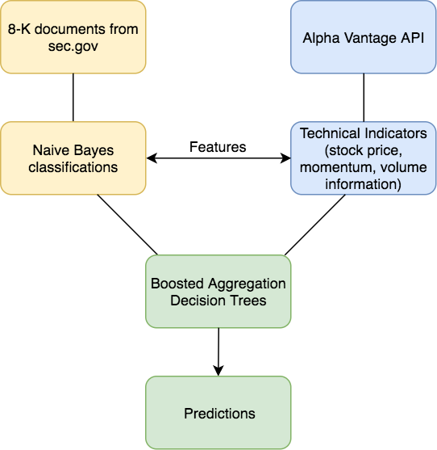

# Predicting stock price directional movement after 8-K filings
*This project is intended to explore machine learning concepts using stock market data and not to provide trading recommendations.*

## Background and motivation
A form 8-K is a general form used by publicly traded companies in the United States to notify shareholders of specific events that may be important. These events can include bankruptcy, the issuing of new shares, change in leadership, and more. [Read more about 8-K's at wikipedia](https://en.wikipedia.org/wiki/Form_8-K).

This project aims to explore two questions:

1) Is there important information that can be gained from 8-K text through Natural Language Processing?

2) Can this, along with information about recent stock price performance, be used to predict stock price movement?

## Data
* More than 48,000 8-K's scraped from sec.gov for all current S&P 500 companies. ([See my gist on how to web scrape sec.gov.](https://gist.github.com/Luke-G-B/bacbdeeb3c5502651fc6e84e5c50edb1)
  * The filing date on the 8-K's range from 2000 to 2018
* Stock price data collected from the Alpha Vantage API
  * Daily price info
  * [Relative Strength Index](https://www.investopedia.com/terms/r/rsi.asp)
  * [Commodity Channel Index](http://stockcharts.com/school/doku.php?id=chart_school:technical_indicators:commodity_channel_index_cci)
  * [On Balance Volume](https://www.investopedia.com/terms/o/onbalancevolume.asp)
  * [Exponential Moving Average](https://www.investopedia.com/terms/e/ema.asp)

## Model flow

**Target**: The target the models are trained on, and what is predicted in the holdout set is the closing price after the 8-K filing is divided by the opening price after the filing. For example, if the 8-K was filed after market close on trading day one, the closing price on trading day two divided by the opening price on trading day two is used as the target.

#### Natural Language Processing (NLP) model
The corpus of 8-K texts is vectorized into a bag of words. The bag of words is then used as the feature matrix in a Multinomial Naive Bayes model, which classifies each 8-K into either a negative class, predicting the stock price will go down, or a positive class, predicting the stock price will go up.

#### Technical Indicators (TI) model
Relative Strength Index (5 day), Commodity Channel Index ( 5 day), On Balance Volume, Moving Standard Deviation (5 day), Moving Average of each aforementioned feature (5 day.)

#### NLP + TI
The NLP classifications is added as a feature along with the TI features and trained and evaluated on the same target.

## Evaluation
All data is split into one training and one holdout set. The models are trained on the training set and evaluated on the holdout set. All true predictions are important, because both are actionable (if the model predicts the stock price will go down, a short position is opened. If the model predicts the stock price will go up, a long position is opened.) Therefore, all models are evaluated on overall accuracy, and estimated rate of return.

**NLP model**

Accuracy: .521

**TI model**

Accuracy: .528

**NLP + TI model**

Accuracy: .533

Taking all ~16,000 predictions from the holdout set and sorting by predicted probability in descending order, the below chart visualizes the profit and loss of each trade. Each dot represents either a short or long position taken on the stock following the 8-K filing. Blue dots are trades that the model predicted correctly and red dots are trades the model predicted incorrectly.

Again, sorting all predictions by predicted probability, the below profit curve visualizes the cumulative profit or loss if each trade over the 18 year period was placed. The Technical Indicators + Naive Bayes model has a max profit of nearly 2000% over the 18 year period. This can be compared with the orange line, representing the Naive Bayes model alone, the green line representing randomly going long or short, and the black line representing always going long (and demonstrating the upward bias of the market.)

